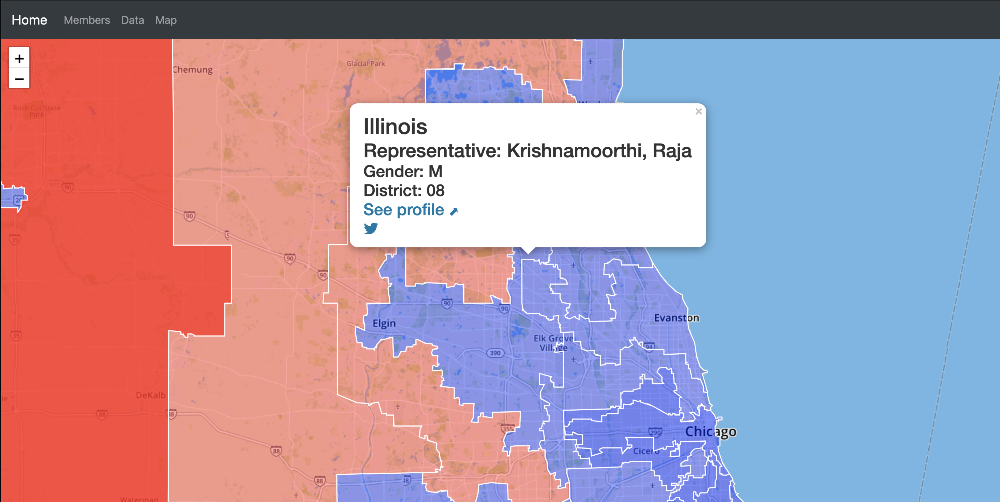
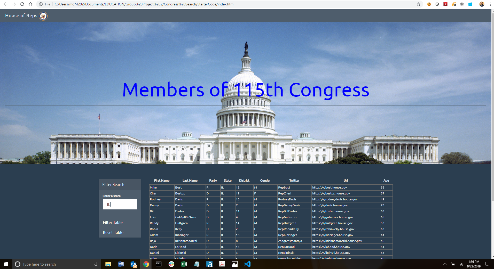
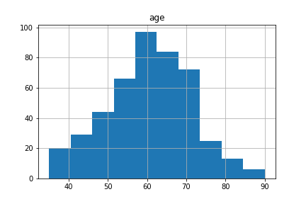
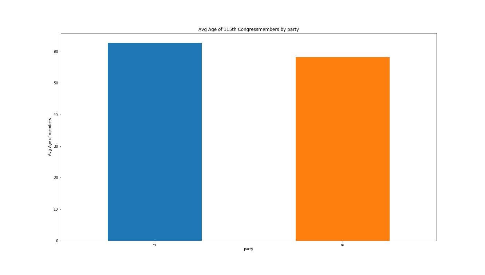
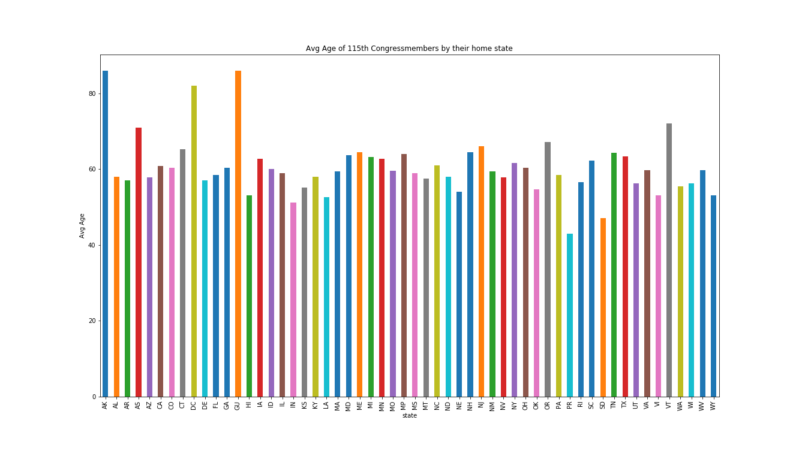
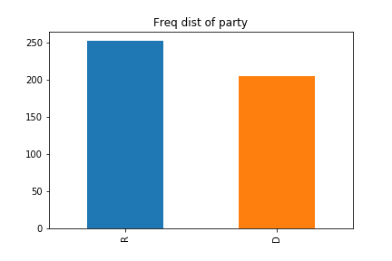

# Project 2 : Telling a Story with Data
Tell a story with data using at least one database(SQL,MongoDB,SQLite,etc) and must include a Python Flask-Powered RESTful API, HTML/CSS and JavaScriot.
## Analyzing the 115th US House of Representatives Data
<br />

 ### Team Members : Marylu Granja , Cesar Martinez , Saj Khan
 
 <br />
 
 

<br />
 
 ## Summary

For this project we analyzed the 115th US House of Representative data to visually represent the district, gender, party, and age composition of the Congressional members. Additionally, we scraped the Congress' Twitter account and a news source to view the recent posts related to the House.
Using API calls and a geoJSON file, we generated the member content and profile information from [ProPublica](https://projects.propublica.org/api-docs/congress-api/members/#lists-of-members) and [OpenDataSoft](https://public.opendatasoft.com/explore/dataset/us-115th-congress-members). 

Using these data sets and leveraging web scraping, JavaScript, DOM Manipulation, and Leaflet we created HTMLs to visualize the following:

- A landing page that displays web-scraped data from Twitter and CNN.com
- A table that lists the 115th House of Representatives with the added feature to filter on the State-level
- Insight of the House of Representatives with charts that visualize based on state, gender, party, and age
- A map that displays each congressional district distinguished by a style layer related to their party 

For the initial visualization page, we aggregate data from other websites.  Using BeautifulSoup library to scrape, we extract data from the Congress Twitter account and the most recent Congress news story from CNN.  The data is stored in Mongo DB.   In order to publish data in different HTML files, the app.py file assigns specific routes and global variables to accommodate the Flask environment.
```python
# Twitter web scraping in scraping.py
def congress_tweet(browser):
​
    url = 'https://twitter.com/congressdotgov?ref_src=twsrc%5Egoogle%7Ctwcamp%5Eserp%7Ctwgr%5Eauthor'
    browser.visit(url)
​
    html = browser.html
    twitter_soup = BeautifulSoup(html, 'html.parser')
​
    congress_tweet = twitter_soup.find('p', class_='TweetTextSize').text
​
    browser.quit()
    return congress_tweet

# define global variable and routes in app.py
@app.route("/")
def home():
    global congress
    try:    
        congress = client.congress.congress
        congress_data = congress_scrape.scrape_info()
        congress.update({}, congress_data, upsert=True)
        congress = client.congress.congress.find_one()
​
        return render_template("index.html", congress=congress)

    except:
        pass
​
@app.route("/members")
def members():
    return render_template("members.html")

@app.route("/insight")
def members():
    return render_template("insight.html")
​
@app.route("/map")
def map():
  return render_template("map.html")
```
For the map visualization we display each congressional district distinguished by their party with Leaflet. We considered utilizing MongoDB for the ETL to combine the two data sets but the file size of the geoJSON exceeds the 16 MB limit. The alternative was to merge the data sets with Python.

During the initial steps, we call on PyGeoj, a Python GeoJSON file reader and writer, to unpack, clean, and append the data to a dataframe:

```python
data = pygeoj.load("Data/us-115th-congress-members.geojson")

type_raw = []
coordinates = []
state_label = []
district = []
rep_sen = []
party = []
name = []
url = []

for feature in data:
    try:
        type_raw.append(feature.geometry.type)
        coordinates.append(feature.geometry.coordinates)
        state_label.append(feature.properties['state_label'])
        district.append(feature.properties['district'])
        rep_sen.append(feature.properties['rep_sen'])
        party.append(feature.properties['party'])
        name.append(feature.properties['name'])
        url.append(feature.properties['url'])
    except (TypeError, IndexError):
        print("Type Error, Traceback (most recent call last) ... skipping")
    except (KeyError, IndexError):
        print("Key Error, Traceback (most recent call last) ... skipping")

# step to clean the data
type_final = []
for val in type_raw:
    if val != 'Null':
        type_final.append(val)

data_dict = {'type' : type_final, 'coordinates': coordinates, 'state_label': state_label, 'district': district, \
             'rep_sen': rep_sen, 'party': party, 'name': name, 'url': url}

data_df = pd.DataFrame(data_dict)

## merge two datasets
data_propublica_condensed = data_propublica[['geoid', 'date_of_birth', 'first_name', 'last_name', 'gender', 'twitter_account']]
combined_data = pd.merge(data_opd_final, data_propublica_condensed, on = 'geoid')
```

To export the dataframe the following function creates the elements for the geoJSON:

```python
def df_to_geojson(df, properties):
    
    ## df : the dataframe to convert to geoJSON
    ## properties : a list of columns in the dataframe to turn into geoJSON feature properties
   
    # create a new dictionary to contain properly formatted geoJSON data
    geojson = {'type':'FeatureCollection', 'features':[]}
 
    for x, row in df.iterrows():

        feature = {'type':'Feature',
                   'geometry':{'type': [],
                               'coordinates':[]},
                   'properties': {}}

        # fill in the type, coordinates
        feature['geometry']['type'] = row.type
        feature['geometry']['coordinates'] = row.coordinates

        # convert the array to a pandas.Series
        geo_props = pd.Series(row)

        # for each column, get the value and add it as a new feature property
        # prop determines the list from the properties
        for prop in properties:

            geo_props[prop] = geo_props[prop]

            # now create a json format, here we have to make the dictionary properties
            feature['properties'][prop] = geo_props[prop]

        # add this feature to the list of features inside the dictionary
        geojson['features'].append(feature)
        
    return geojson

## query selected columns for features.properties dictionary, create geoJSON for export
production_columns = ['state_label', 'district', 'rep_sen', 'party', 'name', 'first_name', 'last_name', \
                        'gender', 'date_of_birth', 'url', 'twitter_account']
geojson_dict = df_to_geojson(combined_data, properties = production_columns)
```

The following Javascript examples renders the colors for the party and displays the pop-ups on the map:

```javascript
function chooseColor(party) {
    switch (party) {
    case "Democratic":
        return "blue";
    default:
        return "red";
}}

d3.json(link).then(function(data) {
    //console.log(data);
    // creating a geojson layer with the retrieved data
    L.geoJson(data, {
      // style each feature in this case a district
      style: function(feature) {
        return {
          color: "white",
          // Call the chooseColor function to decide which color to color the party (color based on D or R)
          fillColor: chooseColor(feature.properties.party),
          fillOpacity: 0.5,
          weight: 1.5
        };
      },
// giving each feature a pop-up with information pertinent to its property
        layer.bindPopup("<h2>" + feature.properties.state_label + "</h2><h3>Representative: " + feature.properties.name + "</h3><h4>Gender: " + feature.properties.gender + "</h4><h4>District: " + feature.properties.district + "</h4><h4><a href='" + feature.properties.url + "' target='_blank'>See profile &#11016;</a></h4><h4><a href='https://twitter.com/" + feature.properties.twitter_account + "' target='_blank'><i style='font-size:24px' class='fa'>&#xf099;</i></a></h4>", {maxWidth: 500});
```



[Geoff Boeing](https://geoffboeing.com/) provides a useful reference on the function utilized to export the geoJSON from the data frame. 

# Filtered Table
<br />

### Example 1 : Hawaii 


### Example 2 : Illinois



### Steps to create the filtered table
Step 1 : API Calls <br />
```python
import pandas as pd

id = []
first_name = []
last_name = []
party = []
state = []
district =[]
gender = []
date_of_birth = []
url = []
twitter_account = []
```
```python
import json
import requests
import api_keys as AK

def proAPI():
	api_key  = AK.api_key 
	#url = "https://api.propublica.org/congress/v1/115/senate/members.json"
	# get recent bills
	url = "https://api.propublica.org/congress/v1/115/house/members.json"
	r = requests.get(url,headers={"X-API-KEY":""})
	return r.content
	#return r.content

def print_data(data):
	r = json.loads(data)
	members = r['results'][0]['members']
	for i in range(len(members)):
		id.append(members[i]['id'])
#		print(members[i]['id'])
		first_name.append(members[i]['first_name'])
		last_name.append(members[i]['last_name'])
		party.append(members[i]['party'])
		state.append(members[i]['state'])
		district.append(members[i]['district'])
		gender.append(members[i]['gender'])
		date_of_birth.append(members[i]['date_of_birth'])
		twitter_account.append(members[i]['twitter_account'])
		url.append(members[i]['url'])
#		print ("")


if __name__ == '__main__':
	data = proAPI()
	print_data(data)
```


Step 2 & Step 3: Create Dictionary & Create Data Frame <br />
```python
import pandas
Congress_dict = {
    #"id": id,
    "first_name":first_name,
    "last_name":last_name, 
    "party":party, 
    "state": state,
    "district": district,
    "gender":gender, 
    "date_of_birth":date_of_birth, 
    "twitter_account": twitter_account,
    "url":url
}

Congress_data = pd.DataFrame(Congress_dict)

Congress_data.count()
```
Step 4 : Convert object datatype to datetime to calculate age off of DOB <br />
```python
import datetime
Congress_data['date_of_birth'] =  pd.to_datetime(Congress_data['date_of_birth'])
#Congress_data.head()
Congress_data.dtypes
```
```python
import datetime as DT
import io
import numpy as np
import pandas as pd

pd.options.mode.chained_assignment = 'warn'

now = pd.Timestamp('now')
Congress_data['age'] = (now - Congress_data['date_of_birth']).astype('<m8[Y]')    # 3
Congress_data.head()
```
Step 5 : Jsonify the dataframe <br />

```python
Congress_data.to_json(orient='records')
```
Step 6 : Add APP.js , Style.css and Index Files to add the filtred data webpage <br />

### Visualizations of Propublica Data
Using the python df.describe() function we deduced that the average age of congress members is a little over 60 years. The youngest member is 35 years of age and the oldest member is 90 years of age. <br />
Further more using Matplotlib.pyplot histograms for visual representation we uncovered that most of the congress members were within 50-70 years of age. <br />

 <br />
 Per the data, Democrats are older as a group compared to the republicans.
 <br />


 <br />
 We also built a chart to compare the average age of members by their home state. 
 <br />
 
 

<br />

Using the same pyplot package we represested the counts of Congress members by Gender and by Party.

<br />


<br />


